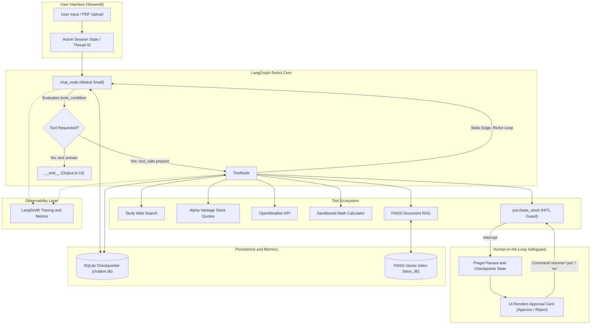
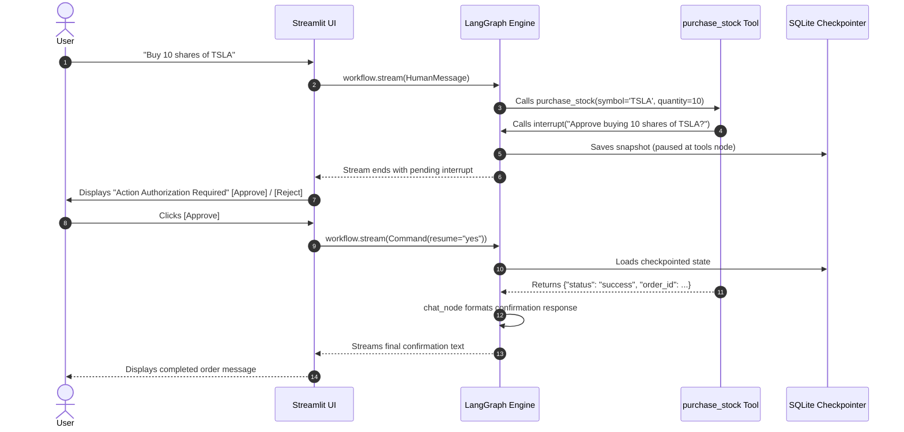

# Agentic AI Assistant

[](https://agentic-chatbot-0jel.onrender.com/)
[](https://www.python.org/)
[](https://langchain-ai.github.io/langgraph/)
[](https://mistral.ai/)
[](https://github.com/facebookresearch/faiss)
[](https://smith.langchain.com/)
[](https://streamlit.io/)
[](https://www.docker.com/)

An enterprise-grade, stateful Agentic Chatbot built with LangGraph, LangChain, and Mistral AI, featuring Human-in-the-Loop (HITL) safeguards, dynamic FAISS Vector RAG, multi-tool execution, persistent SQLite session checkpointing, production-grade LangSmith observability, and a modern Streamlit user interface.

---

## Table of Contents
- [Executive Overview](#executive-overview)
- [System Architecture](#system-architecture)
- [Technical Capabilities](#technical-capabilities)
- [Human-in-the-Loop (HITL) Workflow](#human-in-the-loop-hitl-workflow)
- [Tech Stack](#tech-stack)
- [Project Directory Structure](#project-directory-structure)
- [Local Getting Started Guide](#local-getting-started-guide)
- [Environment Configuration](#environment-configuration)
- [Production Deployment](#production-deployment)
- [Engineering Highlights and Technical FAQ](#engineering-highlights-and-technical-faq)

---

## Executive Overview

This project implements a cyclical ReAct (Reasoning + Acting) autonomous agent capable of:
1. **Autonomous Tool Routing**: Intelligently deciding when to query the web, fetch live market data, calculate mathematical expressions, or retrieve facts from indexed PDF documents.
2. **Human-in-the-Loop (HITL) Guardrails**: Pausing execution state for sensitive actions (such as simulated financial transactions) and awaiting explicit human approval via `interrupt()` and `Command(resume=...)`.
3. **Stateful Conversation Memory**: Persisting multi-turn conversational threads across server restarts and user sessions via SQLite checkpointers.
4. **On-Demand Document RAG**: Processing and semantically indexing user-uploaded PDFs dynamically using Google Gemini embeddings and FAISS vector search.
5. **Full-Stack LangSmith Observability**: Providing granular, real-time tracing, token usage monitoring, latency profiling, and intermediate reasoning inspection across every graph run.

---

## System Architecture



---

## Technical Capabilities

### 1. Autonomous ReAct Agent Loop
- Uses `mistralai:mistral-small-latest` bound with dynamic tool schemas via `.bind_tools()`.
- Implements cyclic graph traversal (`chat_node` <--> `ToolNode`) until all required intermediate steps are satisfied before returning a final answer.

### 2. Human-in-the-Loop (HITL) Action Guard
- Demonstrates safe agentic automation: sensitive tools (e.g., `purchase_stock`) call `interrupt(...)`.
- The execution pauses, state is checkpointed in SQLite, and the UI presents an interactive authorization prompt.
- User input is injected directly back into the paused execution frame via `Command(resume=decision)`.

### 3. On-Demand Document RAG (Retrieval-Augmented Generation)
- **Document Loading & Chunking**: Utilizes `PyPDFLoader` and `RecursiveCharacterTextSplitter` (1000 chunk size, 200 overlap).
- **Vector Embeddings**: Uses Google Generative AI (`models/gemini-embedding-001`).
- **Vector Indexing**: Employs local `FAISS` vector index for similarity search (`k=4`).
- **Dynamic Context Injection**: The active document context is passed via `RunnableConfig` without altering the global graph schema.

### 4. Multi-Threaded Persistent Conversation Memory
- Uses `SqliteSaver` with `check_same_thread=False` to handle Streamlit worker thread concurrency safely.
- Conversation state uses `Annotated[list[BaseMessage], add_messages]` reducer for non-destructive message appending and ID-based deduplication.
- Supports switching between multiple independent conversation threads.

### 5. Sandboxed Math Evaluation
- Safe calculator evaluation by explicitly stripping Python's `__builtins__` (`eval(expression, {"__builtins__": {}}, allowed)`), mitigating arbitrary code execution vulnerabilities.

### 6. Production-Grade Observability and Telemetry (LangSmith)
- **Real-Time Execution Tracing**: Captures complete step-by-step call trees across nodes, tool invocations, and LLM responses.
- **Latency & Token Profiling**: Monitors prompt tokens, completion tokens, and end-to-end response latency for performance auditing.
- **State Inspection**: Enables visual debugging of intermediate inputs, outputs, and checkpoint state transitions in production.

---

## Human-in-the-Loop (HITL) Workflow



---

## Tech Stack

| Domain | Technology | Purpose |
| :--- | :--- | :--- |
| **Agent Framework** | `LangGraph 1.2+` | Graph orchestration, cyclical loops, interrupts, state management |
| **LLM Orchestration** | `LangChain 1.3+` | Tool abstraction, prompt management, message typing |
| **Primary LLM** | `Mistral Small` (`mistralai`) | Reasoning, function calling, conversational generation |
| **Embeddings** | `Google Gemini` (`gemini-embedding-001`) | High-dimensional semantic vector representations |
| **Vector Database** | `FAISS (CPU)` | Fast, localized semantic similarity retrieval for uploaded PDFs |
| **Checkpointer** | `SqliteSaver` (`sqlite3`) | Persistent session memory & HITL state serialization |
| **Web UI** | `Streamlit 1.62+` | Responsive frontend, real-time message token streaming |
| **Search API** | `Tavily Search` | Real-time web browsing tool |
| **Market Data** | `Alpha Vantage` | Live stock quote API |
| **Weather Data** | `OpenWeatherMap API` | Real-time worldwide weather and geocoding |
| **Containerization** | `Docker` | Production environment packaging and isolation |
| **Cloud Hosting** | `Render` | Managed cloud container deployment |
| **Observability** | `LangSmith` | Distributed agent trace logging and latency profiling |

---

## Project Directory Structure

```text
agentic-chatbot/
├── .streamlit/
│   └── config.toml          # Enforces light mode and theme styling
├── .env.example             # Documented template of required API keys
├── .gitignore               # Ignores secrets, caches, and database files
├── .dockerignore            # Build optimization and secret leak prevention
├── Dockerfile               # Production container definition (Python 3.11-slim)
├── requirements.txt         # Pinned Python package dependencies
├── pyproject.toml           # Project metadata & dependency definitions
├── chatbot.py               # Core LangGraph graph, tools, RAG & checkpointer
├── app.py                   # Streamlit frontend with HITL card & token streaming
└── README.md                # Comprehensive documentation
```

---

## Local Getting Started Guide

### 1. Prerequisites
- Python 3.11+
- Git

### 2. Clone the Repository
```bash
git clone https://github.com/PrathmeshRanjan/agentic-chatbot.git
cd agentic-chatbot
```

### 3. Create a Virtual Environment
```bash
python3 -m venv .venv
source .venv/bin/activate   # On Windows: .venv\Scripts\activate
```

### 4. Install Dependencies
```bash
pip install --upgrade pip
pip install -r requirements.txt
```

### 5. Set Up Environment Variables
Copy `.env.example` to `.env` and provide your API keys:
```bash
cp .env.example .env
```

### 6. Run the Application
```bash
streamlit run app.py
```
Open your browser at `http://localhost:8501`.

---

## Environment Configuration

Ensure the following keys are provided in your `.env` (or in Render's **Environment Variables** tab):

| Variable | Required? | Source / Description |
| :--- | :--- | :--- |
| `MISTRAL_API_KEY` | **Yes** | [Mistral AI Console](https://console.mistral.ai/) |
| `GOOGLE_API_KEY` | **Yes** | [Google AI Studio](https://aistudio.google.com/) |
| `TAVILY_API_KEY` | **Yes** | [Tavily Search](https://tavily.com/) |
| `OPENWEATHER_API_KEY` | **Yes** | [OpenWeatherMap](https://openweathermap.org/api) |
| `ALPHAVANTAGE_API_KEY` | **Yes** | [Alpha Vantage](https://www.alphavantage.co/support/#api-key) |
| `LANGSMITH_TRACING` | Optional | Set to `"true"` to enable LangSmith |
| `LANGSMITH_API_KEY` | Optional | [LangSmith](https://smith.langchain.com/) |
| `LANGSMITH_ENDPOINT` | Optional | `https://api.smith.langchain.com` |
| `LANGSMITH_PROJECT` | Optional | Project name in LangSmith dashboard |

---

## Production Deployment

### Docker Deployment
Build and run the container locally:
```bash
# Build image
docker build -t agentic-chatbot .

# Run container with environment variables
docker run -d \
  --restart unless-stopped \
  --name agentic-chatbot \
  -p 8501:8501 \
  --env-file .env \
  agentic-chatbot
```

### Cloud Deployment (Render)
1. Link your GitHub repository to a new **Render Web Service**.
2. Set the Environment runtime to **Docker**.
3. Add your environment variables in the Render dashboard.
4. Render automatically builds and hosts the service with automated SSL at your public URL.

---

## Engineering Highlights and Technical FAQ

<details>
<summary><b>1. Why use <code>Annotated[list[BaseMessage], add_messages]</code> instead of a standard list in state?</b></summary>
<br>
In standard LangGraph dictionary states, updating a key overwrites its existing value. The <code>add_messages</code> reducer overrides this behavior: it appends incoming messages and updates existing messages if an ID matches (deduplication). This allows the conversation history to grow naturally without manual concatenation.
</details>

<details>
<summary><b>2. How does the graph reach the <code>END</code> node if <code>END</code> is never explicitly referenced?</b></summary>
<br>
Conditional routing is handled by <code>graph.add_conditional_edges('chat_node', tools_condition)</code>. Inside LangGraph, <code>tools_condition</code> inspects the last AI message. If tool calls exist, it returns <code>"tools"</code>; otherwise, it returns <code>"__end__"</code> (the internal string representation of <code>END</code>), concluding the graph turn.
</details>

<details>
<summary><b>3. How does <code>interrupt()</code> differ from a standard Python <code>input()</code>?</b></summary>
<br>
A standard <code>input()</code> blocks the Python thread synchronously on the server, making it unscalable for web applications. <code>interrupt()</code> halts graph execution asynchronously, saves the entire execution state to SQLite, and returns control to the web framework. The graph can then be resumed hours or days later on any server worker using <code>Command(resume=...)</code>.
</details>

<details>
<summary><b>4. Why is <code>check_same_thread=False</code> used in SQLite?</b></summary>
<br>
Streamlit uses a multi-threaded architecture where different user interactions and background tasks may run on different threads. By setting <code>check_same_thread=False</code>, SQLite safely permits multiple worker threads to interact with the connection pool.
</details>

---

## Author
Developed by **Prathmesh Ranjan**  
- GitHub: [@PrathmeshRanjan](https://github.com/PrathmeshRanjan)
- Project Repository: [agentic-chatbot](https://github.com/PrathmeshRanjan/agentic-chatbot)
- Live App: [https://agentic-chatbot-0jel.onrender.com/](https://agentic-chatbot-0jel.onrender.com/)
